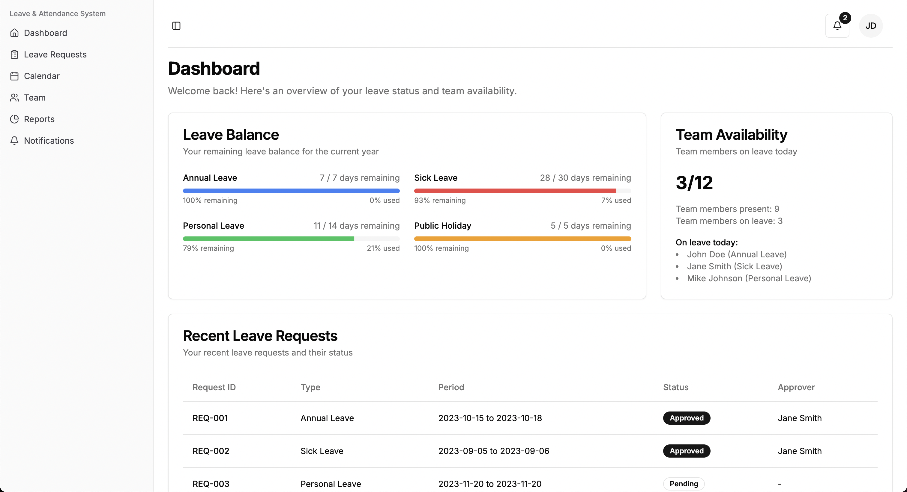

# Leave and Attendance Management System

This is a [Next.js](https://nextjs.org) project bootstrapped with [`create-next-app`](https://nextjs.org/docs/app/api-reference/cli/create-next-app). It provides a platform for managing leave requests, attendance tracking, and team monitoring.



[](https://github.com/ruby0322/tincan-habit-tracker/actions/workflows/playwright.yml)

  

## Live Demo

Visit our testing deployment website [leave-n-attendance.vercel.app](https://leave-n-attendance.vercel.app/) for live demo.

## Features

- **Leave Requests**: Submit and manage leave requests with an intuitive interface.
- **Attendance Tracking**: Monitor attendance records for team members.
- **Team Monitoring**: View team performance and activity summaries.
- **Notifications**: Stay updated with real-time notifications.
- **Reports**: Generate detailed reports for analysis.

## CI/CD Pipeline

This project is fully integrated with a CI/CD pipeline to ensure code quality and seamless deployment:

### Continuous Integration (CI)
- **Unit Tests**: The project uses [Jest](https://jestjs.io) for unit testing. All components and logic are thoroughly tested to ensure correctness.
- **End-to-End Tests**: [Playwright](https://playwright.dev) is used for E2E testing to verify the application's behavior in a browser environment.
- **GitHub Actions**: CI workflows are configured using GitHub Actions to automatically run tests on every push or pull request to the `main` or `master` branches.

### Continuous Deployment (CD)
- **Vercel Auto Deployment**: The project is deployed to [Vercel](https://vercel.com) with automatic deployments triggered on every push to the `main` branch. This ensures the latest changes are always live.

## Getting Started

First, run the development server:

```bash
npm run dev
# or
yarn dev
# or
pnpm dev
# or
bun dev
```

Open [http://localhost:3000](http://localhost:3000) with your browser to see the result.

You can start editing the page by modifying files in the `app/` directory. The application supports hot-reloading, so changes will reflect immediately.

## Tech Stack

- **Framework**: [Next.js](https://nextjs.org)
- **Styling**: [Tailwind CSS](https://tailwindcss.com)
- **Form Validation**: [React Hook Form](https://react-hook-form) with [Zod](https://zod.dev)
- **Icons**: [Lucide React](https://lucide.dev)
- **Date Handling**: [date-fns](https://date-fns.org)

## Folder Structure

- `app/`: Contains the main application pages and layouts.
- `components/`: Reusable UI components like tables, sidebars, and buttons.
- `hooks/`: Custom React hooks for managing state and logic.
- `lib/`: Utility functions and shared logic.